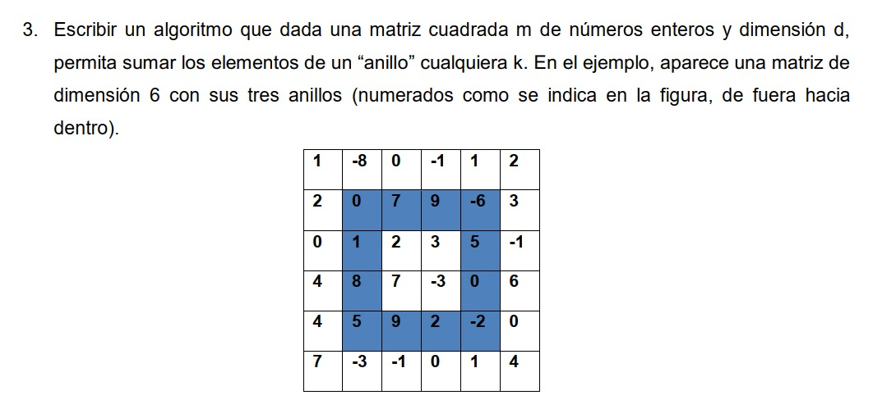
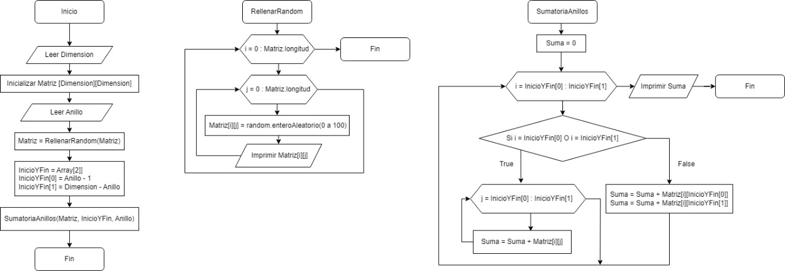

# Sumatoria de anillos en una matriz cuadratica

## Formulación del problema:

  

## Metodología:

### Diseño del algoritmo:

Acordé a los criterios del problema se debe generar una matriz cuadrática de tamaño "dimensión x dimensión", siendo la matriz cuadrática el valor "dimensión" (dim ≥ 1), dicho dato será el n° de filas y n° columnas de la matriz.

También los parámetros del problema exigen que cada elemento de la matriz contenga un número del 0 al 100 aplicado por aleatoriedad.

Con la matriz inicializa,el usuario debe ingresar el n° de anillo que desea su sumatoria dentro del rango de la matriz (n° de anillos = dim/2 [redondeado])

  

### Implementación del algoritmo:

### Análisis del algoritmo:
