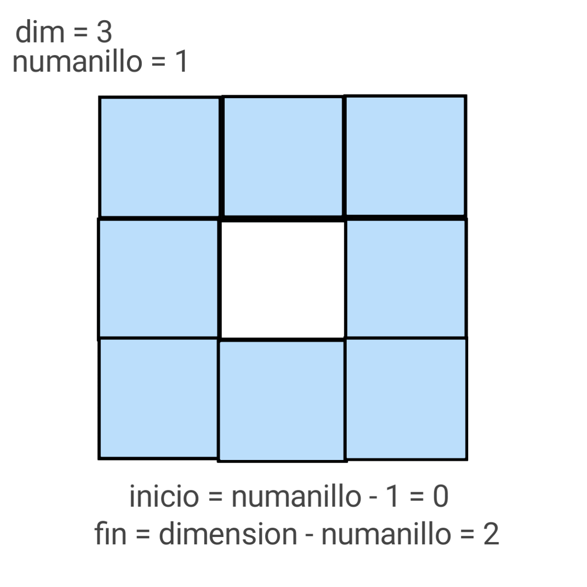

# Sumatoria de anillos en una matriz cuadratica

## Formulación del problema:

  

## Metodología:

### Diseño del algoritmo:

Podemos comprender la resolución del problema mediante el siguiente pseudocodigo:

  

Acordé a los criterios del problema se debe generar una matriz cuadrática de tamaño "dimensión x dimensión", siendo la matriz cuadrática el valor "dimensión" (dim ≥ 1), dicho dato será el n° de filas y n° columnas de la matriz.

También los parámetros del problema exigen que cada elemento de la matriz contenga un número del 0 al 100 aplicado por aleatoriedad.

Con la matriz inicializada,el usuario debe ingresar el n° de anillo que desea su sumatoria, la sumatoria funcionara siempre que lo ingresado este dentro de la cantidad de anillos (dim/2 [redondeado]) en la matriz. 

  

Teniendo los valores de la "dimensión" y el "n° del anillo", es posible calcular los límites superior ("n° del anillo" - 1) e inferior (dim - "n° del anillo") del anillo, es decir, determinar su ubicación en coordenadas de matriz para realizar su recorrido dentro de la misma, así mismo la sumatoria.

### Implementación del algoritmo:

### Análisis del algoritmo:

Analicemos la complejidad de cada método:

1. **Método `RellenarRandom`**:
   - Utiliza dos bucles anidados para recorrer la matriz completa
   - Ambos bucles iteran sobre la dimensión de la matriz
   - Complejidad temporal: O(n²), donde n es la dimensión de la matriz
   - Complejidad espacial: O(n²) para almacenar la matriz

   - Mejor caso: O(n²)

     Siempre recorre toda la matriz
     Independientemente del tamaño, genera números aleatorios en cada posición
     Tiempo de ejecución constante para cada iteración

   - Peor caso: O(n²)

     Igual que el mejor caso
     No hay variación significativa en el rendimiento
     Siempre se recorren todas las posiciones de la matriz

2. **Método `SumatoriaAnillos`**:
   - Contiene dos bucles anidados 
   - El primer bucle itera desde el inicio hasta el final del anillo
   - El segundo bucle interno recorre los elementos de las filas primera y última
   - En el peor caso, también tiene una complejidad de O(n²)

   - Mejor caso: O(n)

   Ocurriría cuando el anillo solicitado es el más externo o el más interno
   Menos iteraciones internas
   Menos elementos a sumar

   - Peor caso: O(n²)

   Cuando se solicita un anillo que requiere recorrer gran parte de la matriz
   Máximo número de iteraciones
   Suma de más elementos

3. **Método `main`**:
   - Llama a `RellenarRandom` que tiene O(n²)
   - Llama a `SumatoriaAnillos` que también tiene O(n²)
   - Complejidad total: O(n²)

**Complejidad global del algoritmo**:
   - Temporal: O(n²) 
   - Espacial: O(n²)
